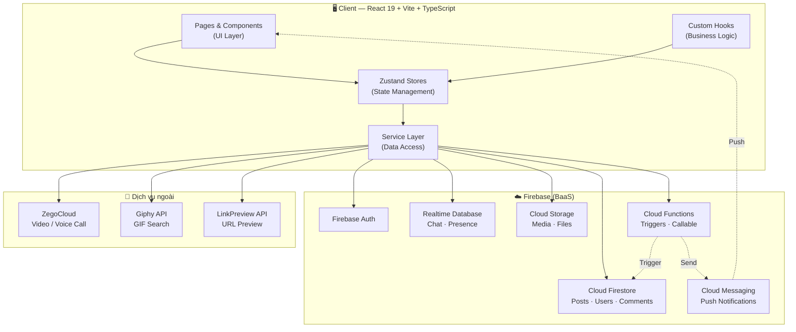
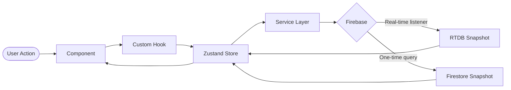
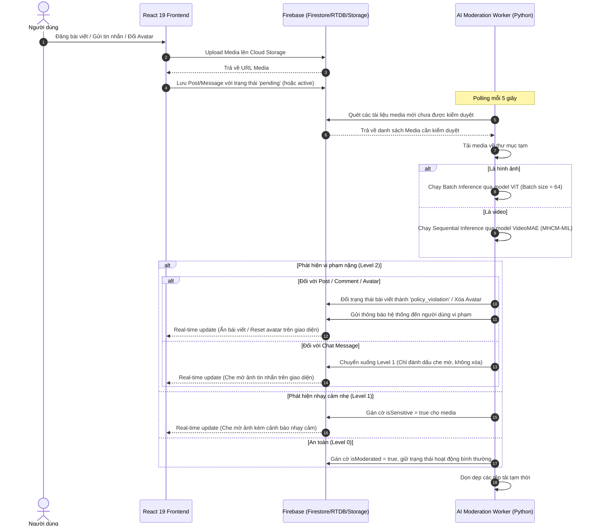
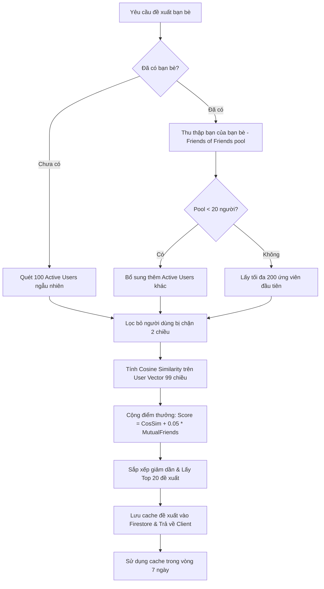
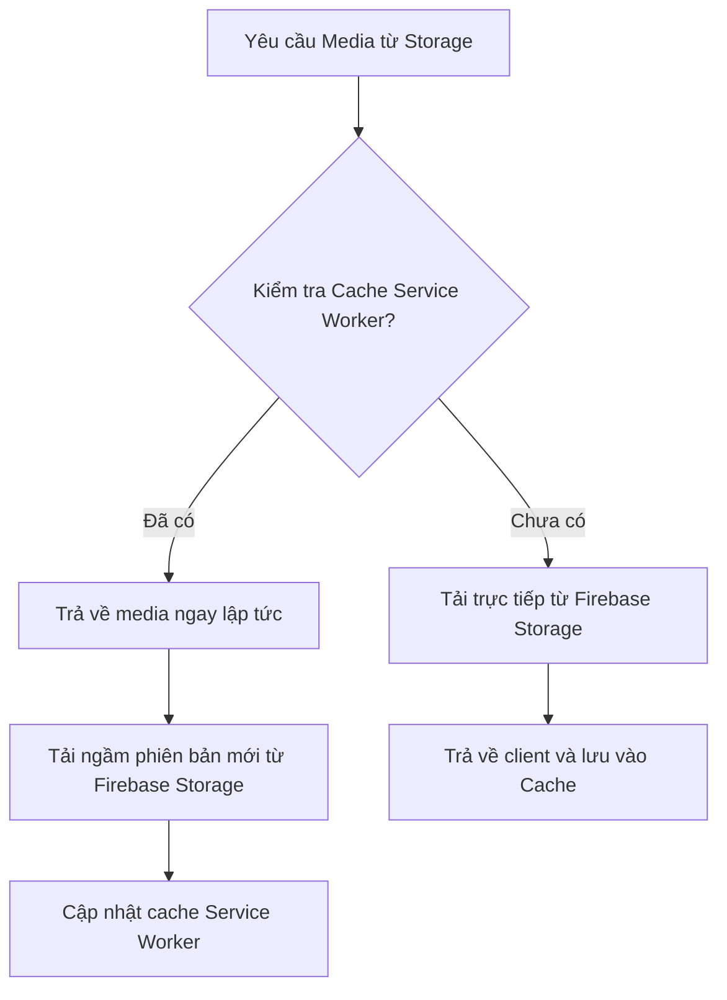

<div align="center">


# Smurfy Social

**Ứng dụng Mạng Xã Hội Real-time**

[](https://react.dev)
[](https://www.typescriptlang.org)
[](https://firebase.google.com)
[](https://vitejs.dev)
[](https://tailwindcss.com)

</div>

---

## 📋 Thông tin đồ án

| Mục         | Nội dung                   |
| ----------- | -------------------------- |
| **Loại**    | Khóa luận tốt nghiệp       |
| **Năm học** | 2025–2026                  |
| **Trường**  | Đại học Công Thương TP.HCM |

### Thành viên nhóm

| Họ và tên          | Vai trò                  |
| ------------------ | ------------------------ |
| **Thái Phúc Hưng** | Trưởng nhóm — Mobile App |
| **Trần Công Minh** | Website (Phần chính)     |
| **Lê Đức Trung**   | Website (Quản trị)       |

---

## 📖 Giới thiệu

**Smurfy** là ứng dụng mạng xã hội được phát triển và mô phỏng các tính năng cốt lõi của một nền tảng social media hiện đại.

Dự án được xây dựng theo kiến trúc **Client-side SPA** với Firebase làm Backend-as-a-Service, nhằm thực hành các kỹ thuật:

- Lập trình giao diện với **React 19 + TypeScript**
- Quản lý trạng thái ứng dụng với **Zustand**
- Xây dựng real-time features với **Firebase Realtime Database**
- Viết server-side logic với **Firebase Cloud Functions**
- Thiết kế bảo mật dữ liệu với **Firestore Security Rules**
- Tích hợp dịch vụ bên thứ ba (**ZegoCloud**, **Giphy API**)

> **Lưu ý:** Đây là dự án khóa luận, không dùng cho mục đích thương mại. Dữ liệu sử dụng phục vụ mục đích demo và kiểm thử.

---

## ✨ Tính năng đã xây dựng

### 🔐 Xác thực & Tài khoản

- Đăng ký / Đăng nhập bằng Email + Password (Firebase Auth)
- Xác minh email trước khi sử dụng
- Luồng onboarding điền thông tin cá nhân sau lần đăng nhập đầu tiên
- Phân quyền: `user` và `admin`
- Chặn người dùng (block) hai chiều

### 💬 Chat & Nhắn tin

- Nhắn tin 1-1 và nhóm theo thời gian thực (Firebase RTDB)
- Hỗ trợ: Text · Hình ảnh · File đính kèm · Voice message · GIF (Giphy)
- Reactions trên từng tin nhắn
- Xem trước link URL (Link preview)
- Hiển thị trạng thái online/offline và chỉ báo "đang nhập..."
- Gọi video / giọng nói 1-1 qua ZegoCloud

### 📰 Feed & Bài viết

- Tạo bài viết với văn bản, nhiều ảnh hoặc video
- Feed cá nhân theo danh sách bạn bè (fan-out on write)
- 6 loại cảm xúc: Like · Love · Haha · Wow · Sad · Angry
- Bình luận lồng nhau (nested) và reactions trên comment
- Kiểm soát quyền xem: công khai / chỉ bạn bè / chỉ mình tôi

### 👥 Quan hệ xã hội

- Gửi / Nhận / Hủy lời mời kết bạn
- Đề xuất bạn bè dựa trên cosine similarity (điểm tương đồng sở thích)
- Danh sách liên lạc với trạng thái hoạt động
- Chặn / Bỏ chặn người dùng

### 🔔 Thông báo

- Thông báo real-time: kết bạn mới, bình luận, reactions, tin nhắn
- Push notification qua Firebase Cloud Messaging (FCM)
- Đánh dấu đã đọc / chưa đọc

### 🛡️ Quản trị (Admin)

- Xem và xử lý các báo cáo vi phạm nội dung
- Quản lý tài khoản: khóa (ban) / mở khóa người dùng
- Tìm kiếm người dùng từ admin panel

### ⚙️ Hồ sơ & Cài đặt

- Chỉnh sửa thông tin, ảnh đại diện và ảnh bìa (với crop ảnh)
- Chuyển đổi giao diện Sáng / Tối

---

## 🏗️ Kiến trúc tổng quan

### Sơ đồ hệ thống tổng quát


### Luồng dữ liệu (Data Flow)


### Sơ đồ hoạt động của AI Moderation Worker (Dịch vụ Kiểm duyệt)


### Phân tầng kiến trúc

| Tầng | Thư mục | Vai trò |
| :--- | :--- | :--- |
| **Presentation** | `pages/`, `components/` | Giao diện, routing, tương tác người dùng |
| **State** | `store/` | Trạng thái toàn cục với Zustand |
| **Logic** | `hooks/` | Xử lý nghiệp vụ, biến đổi dữ liệu |
| **Data Access** | `services/` | Gọi Firebase, gọi API ngoài |
| **Infrastructure** | `firebase/` | Khởi tạo Firebase SDK |
| **Backend** | `functions/` | Server-side logic (Cloud Functions) |
| **Shared** | `utils/`, `constants/` | Hàm tiện ích, hằng số, kiểu dữ liệu |

---

## ⚡ Các tính năng kỹ thuật nổi bật

### 1. Thuật toán gợi ý bạn bè (Cosine Similarity)
Hệ thống sử dụng thuật toán tính toán độ tương đồng để đề xuất bạn bè thông minh, chạy dưới dạng một callable Cloud Function.


*   **Vector hồ sơ (User Vector):** Gồm 99 chiều thể hiện sở thích và hành vi của người dùng.
*   **Điểm thưởng bạn chung (Mutual Friends Bonus):** Điểm xếp hạng cuối cùng được cộng thêm `0.05` cho mỗi bạn chung nhằm tăng cơ hội kết nối trong cùng vòng xã hội thực tế.
*   **Cơ chế lưu đệm (Caching):** Danh sách đề xuất được cache trực tiếp trên Firestore và chỉ tính toán lại sau **7 ngày** (hoặc khi bắt buộc cập nhật bằng tham số `force: true`) nhằm tránh tốn tài nguyên và chi phí gọi API.

### 2. Hệ thống kiểm duyệt nội dung tự động (AI Moderation System)
AI Moderation Worker chạy độc lập bằng Python, kết nối thời gian thực với cơ sở dữ liệu để quét và xử lý nội dung nhạy cảm. Mã nguồn và mô hình AI kiểm duyệt chi tiết được lưu trữ tại repository chính thức: [TPH-Per/sensitive-detection](https://github.com/TPH-Per/sensitive-detection).
*   **Phát hiện hình ảnh:** Sử dụng mô hình **ViT (Vision Transformer)** xử lý theo lô lớn (batch size = 64) nhằm tối ưu hiệu suất xử lý của GPU.
*   **Phát hiện video:** Sử dụng mô hình **VideoMAE (LoRA v7)** xử lý tuần tự để tránh tràn bộ nhớ (OOM) GPU.
*   **Cơ chế phân cấp xử lý:**
    *   **Level 2 (Nghiêm trọng):** Bài viết/bình luận bị chuyển sang trạng thái `policy_violation` (ẩn khỏi feed), ảnh đại diện/ảnh bìa bị xóa về mặc định và hệ thống tự động gửi thông báo vi phạm cho tác giả.
    *   **Level 1 (Nhạy cảm nhẹ):** Media được gắn cờ `isSensitive = true`. Client sẽ tự động che mờ (blur) ảnh/video và hiển thị cảnh báo, người dùng có thể nhấp vào để mở xem.
    *   **Đặc lệ Chat:** Trên kênh chat nhắn tin, nội dung vi phạm Level 2 sẽ tự động hạ cấp xuống Level 1 (chỉ che mờ, không bao giờ ẩn/xóa tin nhắn) để giữ tính liền mạch của cuộc hội thoại.

### 3. Progressive Web App (PWA) & Offline Caching
Ứng dụng được cấu hình như một PWA hoàn chỉnh với khả năng hoạt động ngoại tuyến cơ bản và cơ chế lưu đệm nâng cao.

*   **Chiến lược Caching:** Sử dụng chiến lược `StaleWhileRevalidate` từ Workbox cho tất cả các yêu cầu tải tài nguyên từ Firebase Storage.
*   **Hiệu năng & Chi phí:** Giới hạn lưu tối đa 100 tệp tin media trong 30 ngày. Giúp giảm tối đa số lần tải lại ảnh/video từ Firebase Storage khi người dùng lướt feed, mang lại trải nghiệm mượt mà và giảm đáng kể chi phí băng thông Cloud Storage.

---

## 🚀 Hướng dẫn cài đặt & chạy

### Yêu cầu hệ thống

| Công cụ | Phiên bản |
| :--- | :--- |
| **Node.js** | `>= 18.0.0` |
| **npm** | `>= 9.0.0` |
| **Firebase CLI** | `>= 13.0.0` _(nếu cần deploy rules)_ |

### Bước 1 — Clone dự án
```bash
git clone https://github.com/dexter826/smurf_social.git
cd smurf_social
```

### Bước 2 — Cài đặt dependencies
```bash
npm install
```

### Bước 3 — Thiết lập Firebase
1. Vào [Firebase Console](https://console.firebase.google.com) → Tạo project mới.
2. Kích hoạt các dịch vụ sau:
   * **Authentication** → Sign-in method → Email/Password
   * **Cloud Firestore** → Tạo database (chọn region)
   * **Realtime Database** → Tạo mặc định mặc định
   * **Storage** → Tạo bucket mặc định
   * **Cloud Messaging** → Tạo Web Push certificates và lấy VAPID key.

3. _(Tuỳ chọn)_ Deploy security rules lên production:
```bash
npm install -g firebase-tools
firebase login
firebase use --add        # Chọn project Firebase của bạn
firebase deploy --only firestore:rules,storage,database
```

### Bước 4 — Cấu hình biến môi trường
Tạo tệp `.env` từ `.env.example`:
```bash
cp .env.example .env
# Mở file .env và điền các API key của bạn
```

### Bước 5 — Chạy ứng dụng
```bash
npm run dev
# Ứng dụng chạy tại http://localhost:5173
```

---

## ⚙️ Cấu hình môi trường (`.env`)

Tạo file `.env` từ `.env.example`:

```env
# ── Firebase ────────────────────────────────────────────────
VITE_FIREBASE_API_KEY=AIzaSy...
VITE_FIREBASE_AUTH_DOMAIN=your-project.firebaseapp.com
VITE_FIREBASE_PROJECT_ID=your-project-id
VITE_FIREBASE_STORAGE_BUCKET=your-project.firebasestorage.app
VITE_FIREBASE_MESSAGING_SENDER_ID=123456789
VITE_FIREBASE_APP_ID=1:123456789:web:abc123
VITE_FIREBASE_MEASUREMENT_ID=G-XXXXXXXXXX
VITE_FIREBASE_DATABASE_URL=https://your-project-default-rtdb.firebaseio.com
VITE_FIREBASE_VAPID_KEY=BNH...

# ── ZegoCloud (Video Call) ──────────────────────────────────
VITE_ZEGO_APP_ID=123456789

# ── API ngoài ───────────────────────────────────────────────
VITE_PROVINCES_API_URL=https://provinces.open-api.vn/api/
VITE_LINKPREVIEW_API_KEY=abc123
VITE_GIPHY_API_KEY=abc123
```

### Cách lấy API key

| Biến                       | Nguồn                                                                   |
| -------------------------- | ----------------------------------------------------------------------- |
| Các biến `VITE_FIREBASE_*` | Firebase Console → Project Settings → General → Your apps               |
| `VITE_FIREBASE_VAPID_KEY`  | Project Settings → Cloud Messaging → Web Push certificates              |
| `VITE_ZEGO_APP_ID`         | [console.zegocloud.com](https://console.zegocloud.com) → Projects       |
| `VITE_LINKPREVIEW_API_KEY` | [linkpreview.net](https://linkpreview.net) → Đăng ký tài khoản miễn phí |
| `VITE_GIPHY_API_KEY`       | [developers.giphy.com](https://developers.giphy.com) → Create App       |

> ⚠️ **Không commit file `.env`** lên GitHub. File đã được liệt kê trong `.gitignore`.

---

## 📁 Cấu trúc thư mục

```
smurf_social/
├── public/                    # Tài nguyên tĩnh (favicon, icons)
├── src/
│   ├── assets/                # Hình ảnh, SVG nhúng trong code
│   ├── components/
│   │   ├── admin/             # Giao diện quản trị
│   │   ├── chat/              # Chat bubbles, input, danh sách hội thoại
│   │   ├── contacts/          # Danh sách bạn bè, gợi ý kết bạn
│   │   ├── feed/              # Bài viết, tạo post, reactions
│   │   ├── layout/            # AppLayout, AdminLayout, ProtectedRoute
│   │   ├── notifications/     # Danh sách thông báo
│   │   ├── profile/           # Hồ sơ, ảnh đại diện, ảnh bìa
│   │   ├── settings/          # Các mục cài đặt
│   │   ├── shared/            # Component dùng chung nhiều tính năng
│   │   └── ui/                # Component cơ bản: Toast, Modal, Button...
│   ├── constants/             # Enum, hằng số toàn ứng dụng
│   ├── firebase/
│   │   ├── config.ts          # Khởi tạo Firebase SDK
│   │   └── rtdb.ts            # Helper cho Realtime Database
│   ├── hooks/
│   │   ├── admin/             # Hook cho tính năng admin
│   │   ├── chat/              # Hook chat: tin nhắn, hội thoại
│   │   ├── profile/           # Hook hồ sơ người dùng
│   │   └── utils/             # Hook tiện ích
│   ├── pages/                 # Các trang chính (route-level components)
│   ├── services/
│   │   ├── chat/              # RTDB: tin nhắn, nhóm, cuộc gọi
│   │   ├── authService.ts     # Xác thực
│   │   ├── postService.ts     # CRUD bài viết, reactions
│   │   ├── commentService.ts  # CRUD bình luận
│   │   ├── friendService.ts   # Kết bạn, gợi ý bạn bè, chặn
│   │   ├── notificationService.ts
│   │   ├── reportService.ts
│   │   └── userService.ts
│   ├── store/                 # Zustand — global state
│   │   ├── authStore.ts       # Trạng thái xác thực, user session
│   │   ├── chat/              # Trạng thái chat
│   │   ├── posts/             # Trạng thái bài viết
│   │   └── ...
│   ├── styles/                # CSS toàn cục, design tokens
│   ├── utils/                 # Hàm thuần (pure functions)
│   ├── App.tsx                # Component gốc, cấu hình routing
│   └── index.tsx              # Entry point
│
├── functions/                 # Firebase Cloud Functions (TypeScript)
│   └── src/
│       ├── notifications/     # Triggers gửi FCM (comment, reaction, friend, message)
│       ├── posts/             # Fan-out feed khi viết bài / chặn / kết bạn
│       ├── friends/           # Callable: tạo gợi ý kết bạn (cosine similarity)
│       ├── admin/             # Callable: ban user, resolve/reject report
│       ├── search/            # Callable: tìm kiếm người dùng
│       ├── call/              # Callable: sinh Zego token cho video call
│       ├── scheduled/         # Scheduled job: dọn dữ liệu cũ định kỳ
│       └── index.ts           # Export tất cả functions
├── shared/                    # Types dùng chung giữa client và functions
├── firestore.rules            # Security rules cho Firestore
├── storage.rules              # Security rules cho Storage
├── database.rules.json        # Security rules cho RTDB
├── firestore.indexes.json     # Composite indexes
├── .env.example               # Template biến môi trường
├── vite.config.ts
├── tailwind.config.js
└── tsconfig.json
```

---

## 🤝 Hướng dẫn phân công & làm việc nhóm

Nhóm sử dụng Git để quản lý phiên bản và phân công công việc qua nhánh riêng.

### Quy trình làm việc

```bash
# Mỗi thành viên làm trên nhánh của mình
git checkout -b feat/ten-thanh-vien/ten-tinh-nang

# Commit thường xuyên, mô tả rõ ràng
git commit -m "feat: hoàn thiện giao diện trang chat"

# Merge vào main sau khi kiểm tra
git checkout main
git merge feat/ten-thanh-vien/ten-tinh-nang
```

### Quy ước commit

| Loại        | Ý nghĩa            | Ví dụ                                                |
| ----------- | ------------------ | ---------------------------------------------------- |
| `feat:`     | Thêm tính năng mới | `feat: tích hợp Giphy picker`                        |
| `fix:`      | Sửa lỗi            | `fix: lỗi hiển thị timestamp trong chat`             |
| `refactor:` | Tái cấu trúc code  | `refactor: tách MessageContent thành sub-components` |
| `ui:`       | Thay đổi giao diện | `ui: cập nhật màu dark mode`                         |
| `docs:`     | Cập nhật tài liệu  | `docs: viết README`                                  |

---

## 🗓️ Tiến độ thực hiện

### Giai đoạn 1 — Nền tảng ✅

- [x] Thiết lập project (Vite + React + TypeScript + Firebase)
- [x] Xác thực người dùng (đăng ký, đăng nhập, xác minh email)
- [x] Luồng onboarding
- [x] Cấu trúc routing và layout cơ bản

### Giai đoạn 2 — Tính năng xã hội ✅

- [x] Hệ thống kết bạn (gửi / nhận / hủy lời mời)
- [x] Chặn / bỏ chặn người dùng
- [x] Feed bài viết (tạo, chỉnh sửa, xóa)
- [x] Reactions và bình luận lồng nhau

### Giai đoạn 3 — Nhắn tin & Gọi ✅

- [x] Chat 1-1 real-time (Firebase RTDB)
- [x] Chat nhóm
- [x] Hỗ trợ đa định dạng tin nhắn (ảnh, file, voice, GIF)
- [x] Gọi video / giọng nói (ZegoCloud)

### Giai đoạn 4 — Hoàn thiện ✅

- [x] Thông báo real-time + push notification (FCM)
- [x] Admin dashboard (quản lý user, xử lý báo cáo)
- [x] Giao diện tối / sáng
- [x] Responsive trên mobile

### Giai đoạn 5 — Nâng cao ✅

- [x] Đề xuất bạn bè bằng thuật toán cosine similarity
- [x] Phát hiện và che mờ ảnh / video nhạy cảm

---

## 📄 Giấy phép

Dự án được thực hiện cho mục đích **nghiên cứu và bảo vệ khóa luận tốt nghiệp**.
Không sử dụng lại toàn bộ hoặc một phần mã nguồn cho các mục đích thương mại.

---

<div align="center">

Khóa luận Cử nhân — **Thái Phúc Hưng · Trần Công Minh · Lê Đức Trung** · 2025–2026

[⬆ Về đầu trang](#-smurfy-social)

</div>
